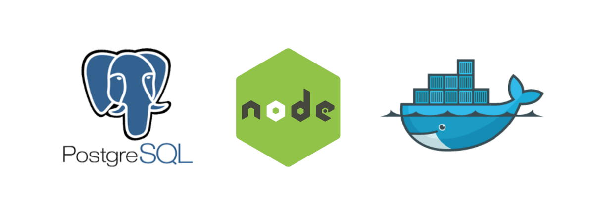

# Pending Tasks:



## Descripción:

Este proyecto es una aplicación web desarrollada con NodeJS, Express, Knex, PostgreSQL, y EJS y consiste en un blog en el que anotar tareas personales que estén pendientes de hacer y no queramos olvidar.

## Cómo poner en marcha el proyecto en local:

### Base de datos:

Para preparar nuestra base datos seguiremos los siguientes pasos:

- Ejecutaremos, en primer lugar, el comando < docker-compose up > para levantar en un docker nuestro servicio de PostgreSQL.

- Para comprobar que nuestro contenedor está levantado ejecutaremos el comado docker ps. Este comando nos tiene que listar los contenedores que tenemos en esta up.

- El siguiente paso será conectar DBeaver con nuestra base de datos. Para ello abriremos la aplicación y crearemos una nueva conexión con root tanto para base de datos como para usuario y contraseña.

- Una vez hecho esto ejecutaremos, desde la raíz de nuestro proyecto, el comando < npm run knexMigrate >. De esta manera, exportaremos nuestros esquemas a la base de datos. Estos esquemas ya tienen que aparecer en nuestra base de datos root.

### Arrancar el servidor:

Para arrancar nuestro servidor de Express ejecutaremos el comando < npm run dev >. Desde este momento, ya podemos empezar a hacer peticione a los diferentes end points desde cualquier cliente web. Nosotros, en este caso hemos usado ejs para construir plantillas de manera que, una vez arrancado el proyecto podemos empezar a utilizarlo desde nuestro navegador en http://localhost:3000.

## Consultas a la base de datos desde la api:

Una de la principales novedades que encontramos en este proyecto frente a otros de los que hemos desarrollado anteriormente es la utilización de una base de datos relacional com es PostgreSql.

Para interactuar con PostgreSQL emplearemos una librería de llamada Knex la cual nos permitirá hacer consultas a la base de datos de una manera sencilla.

A continuación, vamos a ver algunos ejemplos de consultas con knex y cómo se implementarían mediante una consulta SQL en crudo.

### Obtener todas las tareas:

En esta query, pediremos todos los registros y campos de nuestra tabla tasks.

Knex query:

http://localhost:3000/tasks

```js
const dbResponse = await db("tasks").select("id", "title", "type", "content");
```

Raw query:

```sql
select * from tasks
```

### Obtener una tarea por su id:

En esta segunda query pediremos un registro con todos sus campos.

Knex query:

http://localhost:3000/tasks

```js
const dbResponse = await db("tasks")
  .select("id", "title", "type", "content")
  .where({ id: req.params.id });
```

Raw query:

```sql
select * from tasks where id = 0
```

Si sólo quisiéramos dos campos (por ejemplo id y title) los pediríamos de la siguiente manea:

Knex query:

http://localhost:3000/tasks/task/0

```js
const dbResponse = await db("tasks")
  .select("id", "title")
  .where({ id: req.params.id });
```

Raw query:

```sql
select id, title from tasks where id = 0
```

### Insertar una nueva task en nuestra tabla:

Knex query:

http://localhost:3000/tasks/create

```json
{
  "title": "Second test",
  "content": "Test task"
}
```

```js
const dbResponse = await db("tasks").insert(req.body).returning("id");
```

Raw query:

```sql
insert into tasks (title, type, content) values ('Another task', 'Work', 'This is another task')
```

### Actualizar una task en nuestra tabla:

Knex query:

http://localhost:3000/tasks/update/2/Second/Task

```json
{
  "title": "Second",
  "content": "Task"
}
```

```js
await db("tasks").where({ id: req.params.id }).update(req.body);
```

Raw query:

```sql
update tasks set content = 'Task' where id = 2
```

### Borrar una tarea por su id:

Knex query:

http://localhost:3000/tasks/delete/5

```js
await db("tasks").where({ id: req.params.id }).del();
```

Raw query:

```sql
delete from tasks where id = 5
```
